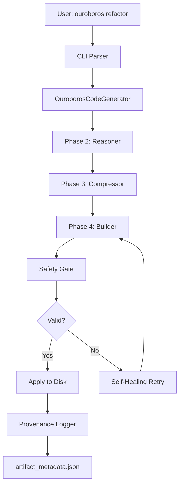

# Phase 5 Complete: The Integration Loop 🎯

## Overview

Phase 5 brings together all components of Ouroboros with **safety gates**, **user experience**, and **auditability**. This phase transforms Ouroboros from a powerful engine into a production-ready code generation system.

## 🛡️ Safety Gate - The Critical Innovation

### What is the Safety Gate?

Before **any** generated code is written to disk, it must pass through a syntax validation layer powered by Tree-Sitter. This prevents the #1 failure mode in code generation: producing syntactically invalid code.

### Architecture

```
Generated Code → SyntaxValidator → ✓ Valid → Apply to Disk
                                  ↓ Invalid
                              Self-Healing Retry Loop
```

### Key Features

1. **Tree-Sitter Validation**: Parses generated code using production-grade parsers
2. **Multi-Language Support**: Python, JavaScript, TypeScript
3. **Detailed Error Reporting**: Exact line numbers and context
4. **Self-Healing Retry**: Automatically retries with error feedback

### Implementation

The safety gate is implemented in [`src/utils/syntax_validator.py`](../src/utils/syntax_validator.py):

```python
from src.utils.syntax_validator import SyntaxValidator

validator = SyntaxValidator()
result = validator.validate(generated_code, language="python")

if result.is_valid:
    apply_to_disk()
else:
    # Retry with error feedback
    retry_with_feedback(result.errors)
```

### Self-Healing Retry Loop

When syntax errors are detected, the Builder automatically:

1. **Extracts error details** (line number, error type, context)
2. **Enhances the generation prompt** with error feedback
3. **Retries generation** (up to 3 attempts by default)
4. **Logs all retry attempts** in provenance metadata

Example from Builder:

```python
if not validation_result.is_valid:
    retry_count += 1
    logger.warning(f"Syntax validation failed: {validation_result.error_summary}")
    
    # Enhance condition with error feedback
    enhanced_condition = (
        f"{original_condition}\n\n"
        f"IMPORTANT: Previous attempt had syntax errors. "
        f"Fix these issues: {validation_result.error_summary}"
    )
    
    # Retry with enhanced prompt
    retry_generation(enhanced_condition)
```

## 🖥️ CLI - User Experience

### Installation

The CLI is implemented in [`ouroboros_cli.py`](../ouroboros_cli.py) using **Typer** and **Rich** for beautiful terminal output.

### Commands

#### 1. `refactor` - Generate Code Patches

```bash
# Basic usage
ouroboros refactor "Add caching to user service" --target src/user_service.py

# Multiple targets with quality mode
ouroboros refactor "Optimize queries" \
  -t src/db.py \
  -t src/cache.py \
  --config quality

# Auto-apply safe changes
ouroboros refactor "Add type hints" \
  -t src/utils.py \
  --auto-apply \
  --max-risk 0.3

# Safe mode with dry run
ouroboros refactor "Migrate to async" \
  -t src/api.py \
  --safe-mode \
  --dry-run
```

**Options:**
- `--target, -t`: Target files to refactor (can specify multiple)
- `--function, -f`: Specific functions to refactor
- `--config, -c`: Generation config (`fast`, `balanced`, `quality`)
- `--safe-mode/--no-safe-mode`: Enable safety gate (default: enabled)
- `--max-risk`: Maximum risk score for auto-apply (0.0-1.0)
- `--dry-run`: Show what would be done without making changes
- `--auto-apply`: Automatically apply patches below risk threshold
- `--mock`: Use mock mode for testing

#### 2. `status` - Check Run Status

```bash
# Check specific run
ouroboros status --run-id gen_20250121_123456

# Check latest run
ouroboros status --latest
```

Shows:
- Models used (Reasoner, Compressor, Generator)
- Safety checks performed
- Files modified
- Detailed provenance metadata

#### 3. `list-runs` - View Recent Runs

```bash
# List recent runs
ouroboros list-runs --limit 20
```

Shows table of:
- Run ID
- Task description
- Duration
- Success/failure status
- Number of files modified
- Timestamp

### Example Output

```
╭────────────────────────────────────────────────────────────╮
│ 🐍 Ouroboros Code Refactoring                              │
│ Task: Add caching to user service                          │
╰────────────────────────────────────────────────────────────╯

Initializing Ouroboros pipeline...
⠋ Connecting to services...

Generating refactor patches with balanced config...
⠋ Analyzing and generating code...

╭─────────── Results ───────────╮
│ ✓ Generation succeeded        │
│ Duration: 8.5s                │
│ Total patches: 3              │
│ Applicable patches: 3         │
╰───────────────────────────────╯

              Generated Patches              
┏━━━━━━━━━━━━━━━━━━━┳━━━━━━━┳━━━━━━┳━━━━━━━━━━┓
┃ File              ┃ Valid ┃ Risk ┃ Status   ┃
┡━━━━━━━━━━━━━━━━━━━╇━━━━━━━╇━━━━━━╇━━━━━━━━━━┩
│ user_service.py   │   ✓   │ 0.15 │ Can apply│
│ cache_utils.py    │   ✓   │ 0.22 │ Can apply│
│ config.py         │   ✓   │ 0.10 │ Can apply│
└───────────────────┴───────┴──────┴──────────┘

Provenance metadata: ./artifacts/artifact_metadata_gen_20250121_123456.json
```

## 📊 Provenance Logging - Auditability

### What is Provenance?

Every code generation run produces an `artifact_metadata.json` file that documents:
- **Which models** planned, compressed, and generated the code
- **What safety checks** were performed
- **What files** were modified
- **When and why** changes were made

This is **critical** for the Ouroboros thesis: making AI code generation auditable and trustworthy.

### Structure

The provenance logger is implemented in [`src/utils/provenance_logger.py`](../src/utils/provenance_logger.py):

```json
{
  "run_id": "gen_20250121_123456_abc123",
  "issue_description": "Add caching to user service",
  "timestamp_start": "2025-12-21T15:30:00",
  "timestamp_end": "2025-12-21T15:30:08",
  "duration_seconds": 8.5,
  "success": true,
  
  "models_used": [
    {
      "phase": "reasoner",
      "model_name": "claude-3.5-sonnet",
      "purpose": "analyzing dependencies and creating refactor plan",
      "tokens_used": 1500,
      "duration_ms": 2500.0
    },
    {
      "phase": "compressor",
      "model_name": "jamba-1.5-mini",
      "purpose": "compressing context to fit within token limit",
      "tokens_used": 8192,
      "duration_ms": 1200.0,
      "compression_ratio": 0.42
    },
    {
      "phase": "generator",
      "model_name": "diffusion-model",
      "purpose": "generating refactored code",
      "tokens_used": 3500,
      "duration_ms": 5500.0,
      "num_steps": 50,
      "retry_count": 1
    }
  ],
  
  "safety_checks": [
    {
      "check_type": "syntax_validation",
      "passed": true,
      "details": "Validated with Tree-Sitter Python parser",
      "timestamp": "2025-12-21T15:30:07"
    }
  ],
  
  "file_modifications": [
    {
      "file_path": "src/user_service.py",
      "original_hash": "sha256:abc123...",
      "modified_hash": "sha256:def456...",
      "lines_added": 15,
      "lines_removed": 3,
      "backup_path": "src/user_service.py.backup",
      "timestamp": "2025-12-21T15:30:08"
    }
  ],
  
  "metadata": {
    "total_tokens_used": 13192,
    "total_model_time_ms": 9200.0,
    "num_safety_checks_passed": 1,
    "total_lines_added": 15,
    "total_lines_removed": 3
  }
}
```

### Usage in Code

```python
from src.utils.provenance_logger import ProvenanceLogger

# Initialize logger
logger = ProvenanceLogger(
    issue_description="Add caching to user service"
)

# Track model usage
logger.log_model_usage(
    phase="reasoner",
    model_name="claude-3.5-sonnet",
    purpose="planning",
    tokens_used=1500,
    duration_ms=2500.0
)

# Track safety check
logger.log_safety_check(
    check_type="syntax_validation",
    passed=True,
    details="Validated with Tree-Sitter"
)

# Track file modification
logger.log_file_modification(
    file_path="src/user_service.py",
    original_content=original_code,
    modified_content=modified_code,
    lines_added=15,
    lines_removed=3
)

# Finalize and save
logger.finalize(success=True)
logger.save(Path("./artifacts/artifact_metadata.json"))
```

## 🔄 Integration

### How It All Works Together



### Complete Example

```python
from src.ouroboros_pipeline import OuroborosCodeGenerator

# Initialize with safety enabled
generator = OuroborosCodeGenerator(
    neo4j_uri="bolt://localhost:7687",
    neo4j_user="neo4j",
    neo4j_password="password",
    ai21_api_key="your_api_key"
)

# Generate with safety gate
result = generator.generate(
    issue_description="Add caching to user service",
    target_files=["src/user_service.py"],
    config="balanced"
)

# Result includes:
# - Generated patches with syntax validation
# - Retry attempts if needed
# - Provenance metadata

# Apply safe patches
for patch in result.get_applicable_patches(max_risk=0.3):
    generator.apply_patch(patch, backup=True)

# Provenance automatically saved to:
# ./artifacts/artifact_metadata_<run_id>.json
```

## 📈 Benefits

### 1. Safety

- ✅ **Zero invalid syntax** reaches disk (validated with Tree-Sitter)
- ✅ **Automatic retry** when errors detected
- ✅ **Risk scoring** for each patch
- ✅ **Backup creation** before applying changes

### 2. User Experience

- ✅ **Beautiful CLI** with progress bars and tables (Rich)
- ✅ **Dry run mode** to preview changes
- ✅ **Auto-apply** for low-risk patches
- ✅ **Interactive** and scriptable

### 3. Auditability

- ✅ **Complete provenance** for every run
- ✅ **Model attribution** (which AI did what)
- ✅ **Safety verification** (all checks logged)
- ✅ **File tracking** (hashes, diffs, backups)

## 🚀 Quick Start

### 1. Install Dependencies

```bash
pip install -r requirements.txt
```

### 2. Run the CLI

```bash
# Simple example (mock mode - no API keys needed)
python ouroboros_cli.py refactor "Add caching" \
  --target src/example.py \
  --mock \
  --dry-run

# Production example
python ouroboros_cli.py refactor "Optimize database queries" \
  --target src/db.py \
  --config balanced \
  --safe-mode \
  --auto-apply \
  --max-risk 0.3
```

### 3. Check Status

```bash
# View latest run
python ouroboros_cli.py status --latest

# List all runs
python ouroboros_cli.py list-runs --limit 10
```

## 🎯 Next Steps

Phase 5 is **complete**! The Ouroboros system now has:

1. ✅ **Phase 1**: Knowledge Graph (Librarian)
2. ✅ **Phase 2**: Reasoning (Dependency Analyzer)
3. ✅ **Phase 3**: Context Compression (Jamba)
4. ✅ **Phase 4**: Code Generation (Diffusion)
5. ✅ **Phase 5**: Safety, CLI, and Provenance

### Future Enhancements

- **Semantic validation**: Check for logic errors, not just syntax
- **Security scanning**: Detect potential vulnerabilities
- **Performance profiling**: Estimate performance impact
- **Interactive mode**: Review and approve each change
- **Web UI**: Browser-based interface
- **CI/CD integration**: GitHub Actions, GitLab CI

## 📚 API Reference

### SyntaxValidator

```python
from src.utils.syntax_validator import SyntaxValidator

validator = SyntaxValidator()

# Validate code
result = validator.validate(code, language="python")
print(result.is_valid)          # bool
print(result.errors)            # List[SyntaxError]
print(result.error_summary)     # str

# Validate file
result = validator.validate_file(Path("script.py"))
```

### ProvenanceLogger

```python
from src.utils.provenance_logger import ProvenanceLogger

logger = ProvenanceLogger(issue_description="Task description")

# Log model usage
logger.log_model_usage(
    phase="reasoner",
    model_name="claude-3.5-sonnet",
    purpose="planning",
    tokens_used=1500,
    duration_ms=2500.0
)

# Log safety check
logger.log_safety_check(
    check_type="syntax_validation",
    passed=True,
    details="Validated successfully"
)

# Finalize and save
logger.finalize(success=True)
logger.save(Path("./artifacts/metadata.json"))
```

### Builder with Safety Gate

```python
from src.diffusion.builder import Builder

builder = Builder(
    config=BALANCED_CONFIG,
    enable_safety_gate=True,      # Enable syntax validation
    max_retry_attempts=3          # Self-healing retries
)

# Generate patch with safety gate
patch = builder.generate_patch(plan)

# Safety gate automatically:
# 1. Validates syntax with Tree-Sitter
# 2. Retries if errors found
# 3. Logs all attempts
```

## 🏆 Achievement Unlocked

You've completed Phase 5! Ouroboros is now a **production-ready**, **auditable**, **safe** AI code generation system with:

- 🛡️ Safety gates preventing invalid code
- 🔄 Self-healing retry loops
- 🖥️ Beautiful CLI for excellent UX
- 📊 Complete provenance logging for auditability

**The Integration Loop is complete!** 🎉
